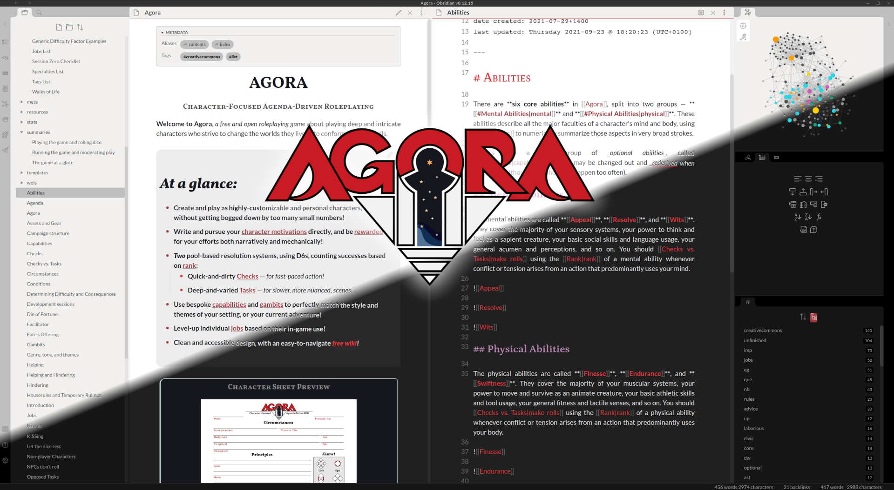

# Agora Obsidian Theme
Obsidian theme for the [Agora TTRPG](https://publish.obsidian.md/agora). 

### Features

- Agora's signature red and black color scheme
- Stylish mix of serif and sans fonts (imported open license fonts)
- Fully functional Dark and Light themes
- Vertical bars between bullets
- Tag pills
- Enlarge image preview on hover
- Round checkboxes
- Naked embeds
- Special tag-styled blockquote dropcaps (see below)

##### Special Feature (tag-styling)

Use any of the following tags to add some special symbols to your document

- `#quote` Big quotation mark, for block quotes
- `#important` A big  exclamation point shaped bullet
- `#question` A question mark shaped bullet
- `#asterisk` A big asterisk shaped bullet

_**Note:**_ This will not look good if you already make use of any of the above tags for any other reason, including in metadata. You will need to manually edit and delete or comment out the ones that you don't want to use if they are causing you problems.

### Changelog

#### v1.1 (11/12/21)

- Added even-odd shading to table rows.
- Generally made embeded articles look better.
- Slightly altered fonts and use of smallcaps in headers.
- Removed unused tag stylings.

#### v1.0 (13/10/21)

- Initial release

## MIT license 2021
